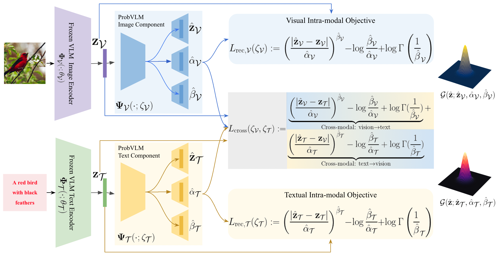

# ProbVLM: Probabilistic Adapter for Frozen Vision-Language Models
## [Arxiv paper](https://arxiv.org/pdf/2307.00398.pdf) || [Blog](https://www.eml-unitue.de/publication/ProbVLM)

## Introduction


**Abstract.** Large-scale vision-language models (VLMs) like CLIP successfully find correspondences between images and text. Through the standard deterministic mapping process, an image or a text sample is mapped to a single vector in the embedding space. This is problematic: as multiple samples (images or text) can abstract the same concept in the physical world, deterministic embeddings do not reflect the inherent ambiguity in the embedding space. We propose **ProbVLM**, a probabilistic adapter that estimates probability distributions for the embeddings of pre-trained VLMs via inter/intra-modal alignment in a post-hoc manner without needing large-scale datasets or computing. On four challenging datasets, i.e., COCO, Flickr, CUB, and Oxford-flowers, we estimate the multi-modal embedding uncertainties for two VLMs, i.e., CLIP and BLIP, quantify the calibration of embedding uncertainties in retrieval tasks and show that **ProbVLM** outperforms other methods. Furthermore, we propose active learning and model selection as two real-world downstream tasks for VLMs and show that the estimated uncertainty aids both tasks. Lastly, we present a novel technique for visualizing the embedding distributions using a large-scale pre-trained latent diffusion model.

***TLDR:*** This is the official [PyTorch](https://pytorch.org/) implementation of ProbVLM (from *ICCV 2023*) that allows estimating calibrated uncertainty for pre-trained (frozen) vision-langugae models in fast and efficient manner.

The structure of the repository is as follows:
```
ProbVLM
|-src/ (has the relevant code to train ProbVLM for a pretrained vision-language model, e.g., CLIP)
|-requirements.txt (the environment dependencies)
|-figs/ (has some example images)
```

## Getting Started

The `src/` directory already provides all the code to load, train, and evaluate the CLIP checkpoints along with the ProbVLM checkpoint. In order to get started, first ensure that you have all the requirements as provided in `requirements.txt`, this can be setup by running
```
conda create --name <env> --file requirements.txt
```

The notebook `src/train_ProbVLM_CLIP.ipynb` shows how to load the CLIP as the base model and how to train ProbVLM for the same using the function,
```python
train_ProbVLM(
    CLIP_Net,
    ProbVLM_Net,
    cub_train_loader,
    cub_valid_loader,
    Cri = TempCombLoss(),
    device='cuda',
    dtype=torch.cuda.FloatTensor,
    init_lr=8e-5,
    num_epochs=500,
    eval_every=5,
    ckpt_path='../ckpt/ProbVLM_Net',
    T1=1e0,
    T2=1e-4
)
```


## Dataset Setup
To setup the COCO, CUB, Flickr and the Oxford-Flowers dataset, please follow the below instructions:

COCO: Download the 2014 data [here](https://cocodataset.org/#home) and setup the directory in the following way
```
coco
|-images/
|--train2014 
|--val2014 
|-captions_train2014.json 
|-captions_val2014.json

```

CUB: Download the CUB-200-2011 dataset [here](http://www.vision.caltech.edu/datasets/cub_200_2011/) and the captions from [https://github.com/reedscot/cvpr2016](https://github.com/reedscot/cvpr2016).  

Flowers: Download the images [here](https://www.robots.ox.ac.uk/~vgg/data/flowers/102/index.html) and the captions from [https://github.com/reedscot/cvpr2016](https://github.com/reedscot/cvpr2016).  


Flickr: Dwonload the images and captions from [here](https://www.kaggle.com/datasets/hsankesara/flickr-image-dataset). 

## Resources

We use the following resources to use as the base models (on top of which we train different ProbVLM models)

- CLIP: [https://github.com/openai/CLIP](https://github.com/openai/CLIP)
- BLIP: [https://github.com/salesforce/LAVIS](https://github.com/salesforce/LAVIS)
- BayesCap: [https://github.com/ExplainableML/BayesCap](https://github.com/ExplainableML/BayesCap) 

## BibTex

Please cite the following works 

```
@inproceedings{Upa_probvlm,
  title = {ProbVLM: Probabilistic Adapter for Frozen Vision-Language Models},
  author = {Upadhyay, U. and Karthik, S. and Mancini, M. and Akata, Z.},
  booktitle = {International Conference on Computer Vision (ICCV 2023)},
  year = {2023}
}
```


```
@inproceedings{Upa_bayescap,
  title = {BayesCap: Bayesian Identity Cap for Calibrated Uncertainty in Frozen Neural Networks},
  author = {Upadhyay, U. and Karthik, S. and Chen, Y. and Mancini, M. and Akata, Z.},
  booktitle = {European Conference on Computer Vision (ECCV 2022)},
  year = {2022}
}
```

```
@inproceedings{upadhyay2021uncerguidedi2i,
  title={Uncertainty Guided Progressive GANs for Medical Image Translation},
  author={Upadhyay, Uddeshya and Chen, Yanbei and Hebb, Tobias and Gatidis, Sergios and Akata, Zeynep},
  booktitle={International Conference on Medical Image Computing and Computer-Assisted Intervention (MICCAI)},
  year={2021},
  organization={Springer}
}
```

```
@inproceedings{UpaCheAka21,
  title = {Robustness via Uncertainty-aware Cycle Consistency},
  author = {Upadhyay, U. and Chen, Y. and Akata, Z.},
  booktitle = {Advances in Neural Information Processing Systems 34 (NeurIPS 2021)},
  year = {2021}
}
```

